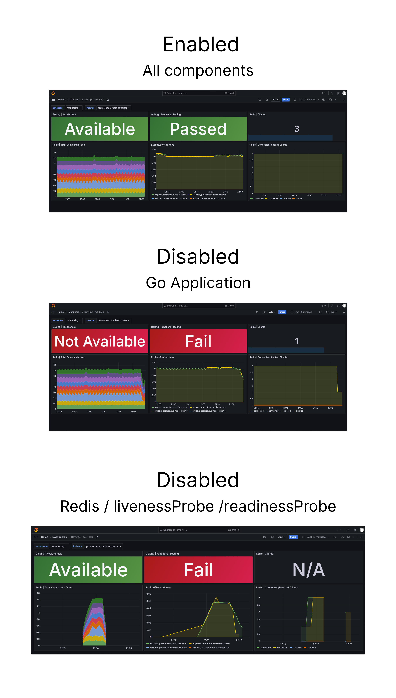
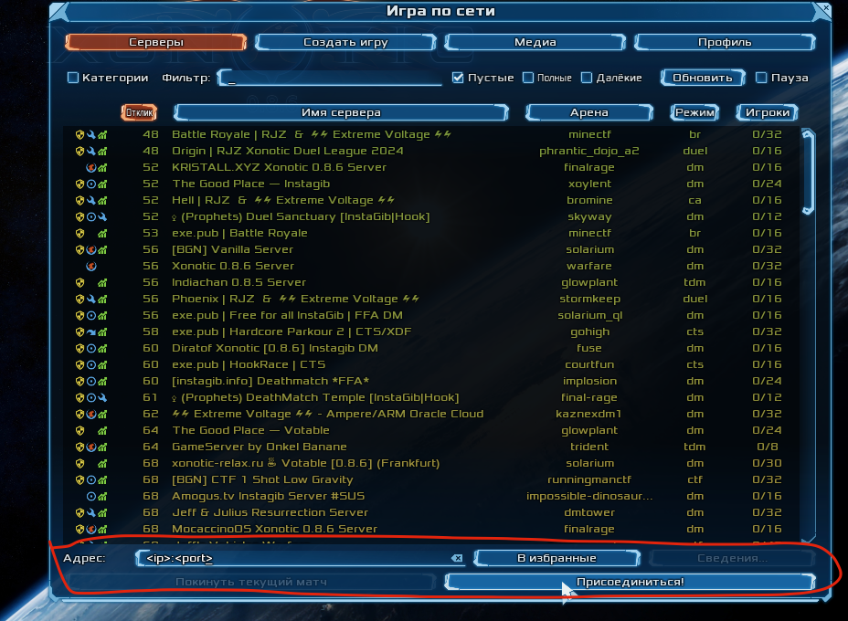

# Devops Test

### Documentation (only unix OS)

> Dependencies: terraform, kubectl, helm, eksctl, aws, curl

1. Specify environment variables for your aws account
```bash
export TF_VAR_cluster_name="<cluster_name>" 
export AWS_REGION="<aws_region>"
export AWS_ACCOUNT_ID="<aws_account_id>"
export AWS_ACCESS_KEY_ID="<aws_account_key_id>"
export AWS_SECRET_ACCESS_KEY="<aws_account_access_key>"
```

2. Start delivery proccess
```bash
sh .cicd/deploy.sh # Wait 15-20 min
```

3. Check output
```
...

cronjob.batch/goapp-exporter configured
configmap/monitoring unchanged
configmap/grafana-devops-test-task-dashboard unchanged
fleet.agones.dev/xonotic unchanged

Golang: http://<***>.elb.amazonaws.com

Grafana: http://<***>.elb.amazonaws.com
User: admin
Pass: admin

Xonotic: <ip>:<port>
```

### Monitoring


### Connect to gameserver


### Task
```
### Overview
This is an application that is a dummy webservice that returns the
last update time.  The last updated time is cached in redis and
resets every 5 seconds.  It has a single '/' endpoint.  The redis
address is passed in through the environment.
NOTE: The following tasks should take no more than 1 hour total.
### Tasks
1. create Dockerfile for this application
2. create docker-compose.yaml to replicate a full running environment
so that a developer can run the entire application locally without having
to run any dependencies (i.e. redis) in a separate process.
3. explain how you would monitor this application in production. please
write code/scripts to do the monitoring.
### MiniKube Tasks
4. prepare local Kubernetes environment (using MiniKube + Helm) to run our application in pod/container.
it should be created a helm chart with resources for deploying application to Kuberenetes. 
store all relevant scripts (kubectl commands etc) in your forked repository.
5. suggest & create minimal local infrastructure to perform functional testing/monitoring of our application pod.
demonstrate monitoring of relevant results & metrics for normal app behavior and failure(s).

Please fork this repository and make a pull request with your changes.
Please provide test monitoring results in any convenient form (files, images, additional notes) as a separate archive.


 
### Additional task
Research https://agones.dev/site/. Deploy agones locally (minikube or docker desktop, kubernetes) or in any cloud. AWS is a big plus. Use https://github.com/googleforgames/agones/tree/main/examples/xonotic as dedicated server. Xonotic client should be able to join a dedicated server. Matchmaker or any other automatic fleet management is not required. Fleet could be managed manually with agones rest api. Provide documentation with steps how to reproduce the environment and test the game
```